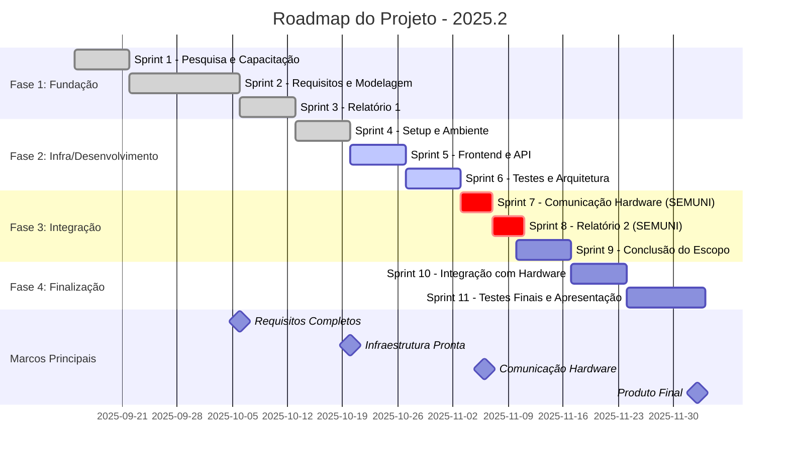

# 2025.2-PI-Software-Docs

Neste espaço encontram-se reunidos todos os artefatos produzidos durante as etapas de concepção, desenvolvimento e validação do sistema. A documentação abrange desde a definição do escopo e dos requisitos até os modelos utilizados, decisões de arquitetura, especificações técnicas, cenários de uso, registros de testes e demais materiais que contribuíram para o aprimoramento e entendimento completo do projeto. Trata-se, portanto, de um repositório centralizado que visa garantir a rastreabilidade, a organização e a clareza de todo o processo de desenvolvimento.

---

<!-- ## Cronograma Seguido

| Semana | Foco Principal | Requisitos Atendidos |
|--------|----------------|---------------------|
| 1 | Infraestrutura e Configuração Base | RNF01, RNF16 |
| 2 | Comunicação TCP e Backend Core | RF02, RF03, RNF10, RNF11 |
| 3 | Interface de Comandos e Validação | RF04, RF07, RNF15, RNF12 |
| 4 | Execução e Monitoramento em Tempo Real | RF09, RF14, RF08, RNF05, RNF06 |
| 5 | Visualização e Histórico de Trajetórias | RF10, RF11, RF12, RF13, RNF07, RNF08 |
| 6 | Parada de Emergência, Refinamentos e Testes | RF08, RF15, RNF09, RNF13, RNF14 |

Mais detalhes em [Link](./cronograma.md)

--- -->

## Arquitetura final

Após algumas alterações no decorrer do projeto a seguir temos a arquitetura final.

Mais detalhes em [Link](./cronograma.md)

---

## Protótipo Final

[Figma Protótipo de Telas de Controle do Carrinho](https://www.figma.com/design/OkpO39vj7ImHyDWaKpwxHB/Prot%C3%B3tipo-Telas-de-Controle-do-Carrinho?node-id=0-1&p=f&t=gJBnpnv5p6toqXYq-0)

---

## Modelagem Banco de Dados

---

## Backward From

A matriz de rastreabilidade Backward From é uma ferramenta utilizada no planejamento de projetos ou processos, com foco em começar pelo objetivo final e, a partir dele, mapear as etapas anteriores necessárias para alcançá-lo. Essa abordagem garante que todas as atividades estejam alinhadas diretamente ao resultado esperado, evitando esforços dispersos ou não prioritários.

Mais detalhes em [Link](./backward-from.md)

---

## Artefatos Produzidos

1. [Casos de Testes](./casos-de-teste.md)
2. [User Stories](./historias-de-usuario.md)
3. [Moscow](./moscow.md)
4. [Requisitos Não Funcionais](./requisitos-nao-funcionais.md)
5. [Diagrama de Estados](./diagrama-caso-uso.md)
6. [Diagrama Caso de Uso](./diagrama-caso-uso.md)

---

## Roadmap Final

Aqui se encontra o Roadmap final de todas as atividades realizadas no decorrer da execução do projeto, contendo suas participações, atribuições e tempo de sprints corridos.

Mais detalhes em [Link](./roadmap.md)

