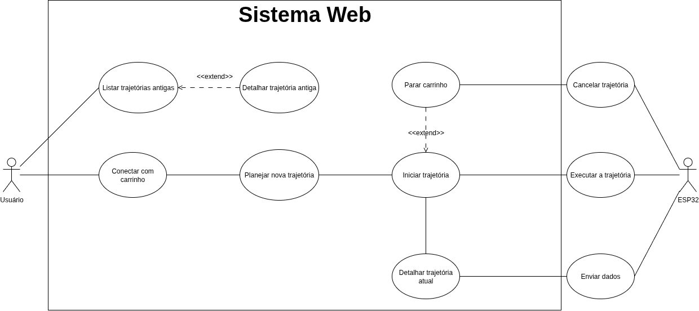

# Diagrama de Caso de Uso

## Introdução

&emsp;&emsp; O presente documento apresenta o diagrama de casos de uso referente ao <b>Sistema Web</b>, cujo objetivo é permitir a interação entre o usuário e um carrinho controlado por meio de uma interface, além da comunicação com o microcontrolador <b>ESP32</b>. O diagrama ilustra os atores envolvidos e as principais funcionalidades disponibilizadas pelo sistema, evidenciando como o usuário pode planejar, iniciar, detalhar e controlar trajetórias, enquanto o ESP32 é responsável pela execução e transmissão de dados relacionados. 

## Objetivo

&emsp;&emsp; O objetivo do diagrama é representar de forma clara e organizada as funcionalidades oferecidas pelo sistema, destacando a relação entre o <b>usuário</b>, o <b>ESP32</b> e o <b>Sistema Web</b>. Dessa forma, busca-se facilitar a compreensão do fluxo de atividades, como o planejamento e execução de trajetórias, a conexão com o carrinho, a listagem de trajetórias antigas e o envio de dados durante a execução. 

## Metodologia

&emsp;&emsp; Para a elaboração do diagrama, foi utilizada a notação UML de casos de uso. Foram identificados dois atores principais: o <b>Usuário</b>, que interage diretamente com o sistema web, e o <b>ESP32</b>, que executa as instruções e transmite informações. Em seguida, foram modelados os casos de uso, organizando-os em funcionalidades principais e relacionamentos do tipo <b>&lt;&lt;extend&gt;&gt;</b>, como no caso de "Detalhar trajetória antiga" e "Parar carrinho". O resultado é um modelo visual que sintetiza a comunicação entre os atores e o sistema. 

## Especificação

### UC1 - Listar trajetórias antigas

| Titulo            | descrição                                              |
| ----------------- | ------------------------------------------------------ |
| descrição         | Listagem de trajetórias antigas                        |
| atores            | Usuário                                                |
| pré-condições     | Usuário está na página principal                       |
| pós-condições     | Exibir informações gerais de todas as trajetórias      |
| fluxo principal   | 1. Usuário acessa a página, 2. Listagem de trajetórias |
| fluxo alternativo |                                                        |
| fluxo de exceção  | 1. Tela de exibição de erro                            |

### UC2 - Detalhar trajetória antiga

| Titulo            | descrição                                                                           |
| ----------------- | ----------------------------------------------------------------------------------- |
| descrição         | Detalhar trajetória antiga                                                          |
| atores            | Usuário                                                                             |
| pré-condições     | Usuário seleciona uma trajetória dentro das listagem de trajetórias                 |
| pós-condições     | Exibir informações detalhadas da trajetória                                         |
| fluxo principal   | 1. Usuário acessa a página, 2. Listagem de trajetórias, 3. Seleciona uma trajetória |
| fluxo alternativo |                                                                                     |
| fluxo de exceção  | 1. Tela de exibição de erro                                                         |

### UC3 - Conectar com carrinho

| Título           | Descrição                                                                                                                                                                                                                                                                                                                     |
| ---------------- | ----------------------------------------------------------------------------------------------------------------------------------------------------------------------------------------------------------------------------------------------------------------------------------------------------------------------------- |
| Descrição        | Estabelece a conexão de comunicação em tempo real entre a interface web do usuário e um carrinho específico na rede.                                                                                                                                                                                                          |
| Atores           | Usuário                                                                                                                                                                                                                                                                                                                       |
| Pré-condições    | 1. O carrinho (ESP32) está ligado e conectado à mesma rede Wi-Fi que o sistema.  2. O usuário está na tela principal da interface web.                                                                                                                                                                                     |
| Pós-condições    | A conexão é estabelecida, e o sistema exibe o status "conectado".                                                                                                                                                                                                                                                             |
| Fluxo principal  | 1. O sistema busca e exibe uma lista de carrinhos online (ou oferece um campo para IP). 2. O usuário seleciona o carrinho desejado e clica em "Conectar". 3. O sistema tenta estabelecer uma conexão com o carrinho. 4. O carrinho aceita a conexão. 5. O sistema atualiza a interface para o estado "Conectado". |
| Fluxo de exceção | 3a. O sistema não consegue se comunicar com o carrinho e exibe a uma mensagem de erro.                                                                                                                                                                                                                                        |

### UC4 - Planejar nova trajetória

| Título           | Descrição                                                                                                                                                                                                                                                                                                                                                                                              |
| ---------------- | ------------------------------------------------------------------------------------------------------------------------------------------------------------------------------------------------------------------------------------------------------------------------------------------------------------------------------------------------------------------------------------------------------ |
| Descrição        | Permite que o usuário crie ou edite uma sequência de comandos que o carrinho deverá executar.                                                                                                                                                                                                                                                                                                          |
| Atores           | Usuário                                                                                                                                                                                                                                                                                                                                                                                                |
| Pré-condições    | 1. O usuário está na área de planejamento da interface.                                                                                                                                                                                                                                                                                                                                                |
| Pós-condições    | A sequência de comandos é enviada ao carrinho.                                                                                                                                                                                                                                                                                                                                                         |
| Fluxo principal  | 1. O sistema exibe os três comandos disponíveis: "Avançar (distância)", "Virar à esquerda", "Virar à direita". 2. O usuário adiciona e ordena os comandos para formar uma sequência, preenchendo o parâmetro "distância" quando necessário. 3. Ao finalizar a montagem, o usuário clica no botão "Enviar" ou "Executar". 4. O sistema envia a sequência de comandos validada para o carrinho. |
| Fluxo de exceção | 4a. Parâmetro inválido (ex: o campo "distância" está vazio, não é um número ou é negativo) e mostra uma mensagem para o usuário.                                                                                                                                                                                                                                                                |
### UC5 - Iniciar trajetória
| Titulo            | descrição                                                                                          |
| ----------------- | -------------------------------------------------------------------------------------------------- |
| descrição         | Confirma comandos e envia eles à ESP32                                                             |
| atores            | Usuário                                                                                            |
| pré-condições     | Usuário digitou uma lista de comandos para o carrinho                                              |
| pós-condições     | ESP32 recebe os comandos a serem executados pelo carrinho                                          |
| fluxo principal   | 1. Usuário entra acessa a página, 2. Usuário planeja nova trajetória, 3. Usuário inicia trajetória |
| fluxo alternativo |                                                                                                    |
| fluxo de exceção  | 1. Tela de exibição de erro                                                                        |

### UC6 - Parar carrinho
| Titulo            | descrição                                                                                                                       |
| ----------------- | ------------------------------------------------------------------------------------------------------------------------------- |
| descrição         | Cancela a trajetória que está sendo executada pelo carrinho                                                                     |
| atores            | Usuário                                                                                                                         |
| pré-condições     | Usuário iniciou uma trajetória                                                                                                  |
| pós-condições     | Carrinho para                                                                                                                   |
| fluxo principal   | 1. Usuário entra acessa a página, 2. Usuário planejou nova trajetória, 3. Usuário inicia trajetória, 4. Usuário para trajetória |
| fluxo alternativo |                                                                                                                                 |
| fluxo de exceção  | 1. Tela de exibição de erro                                                                                                     |

### UC7 - Detalhar trajetória atual

| Titulo            | descrição                                                                                                       |
| ----------------- | --------------------------------------------------------------------------------------------------------------- |
| descrição         | Detalhar trajetória atual                                                                                       |
| atores            | Usuário                                                                                                         |
| pré-condições     | Usuário iniciou uma trajetória                                                                                  |
| pós-condições     | Exibir informações em tempo real da trajetória iniciada                                                         |
| fluxo principal   | 1. Usuário acessa a página, 2. Planeja nova trajetória, 3. Inicia uma trajetória , 4. Detalhar trajetória atual |
| fluxo alternativo |                                                                                                                 |
| fluxo de exceção  | 1. Tela de exibição de erro                                                                                     |

## Resultados

&emsp;&emsp; O diagrama de casos de uso produzido apresenta as seguintes funcionalidades principais: - Conectar com o carrinho; - Planejar nova trajetória; - Listar trajetórias antigas e detalhar uma trajetória selecionada; - Iniciar e detalhar a trajetória atual; - Parar ou cancelar a trajetória; - Executar a trajetória; - Enviar dados pelo ESP32.

Assim, o modelo demonstra como o sistema possibilita tanto a análise de trajetórias passadas quanto o controle em tempo real do carrinho.

<b>Autor(es):</b> Márcio Henrique, Cássio Reis, Eduardo Matheus.

## Conclusão

&emsp;&emsp; Conclui-se que o diagrama de casos de uso desenvolvido permite uma visão clara e simplificada das funcionalidades essenciais do sistema web e de como os atores se relacionam. A modelagem favorece o entendimento inicial dos requisitos do sistema, servindo de base para etapas posteriores de análise, projeto e implementação. 

