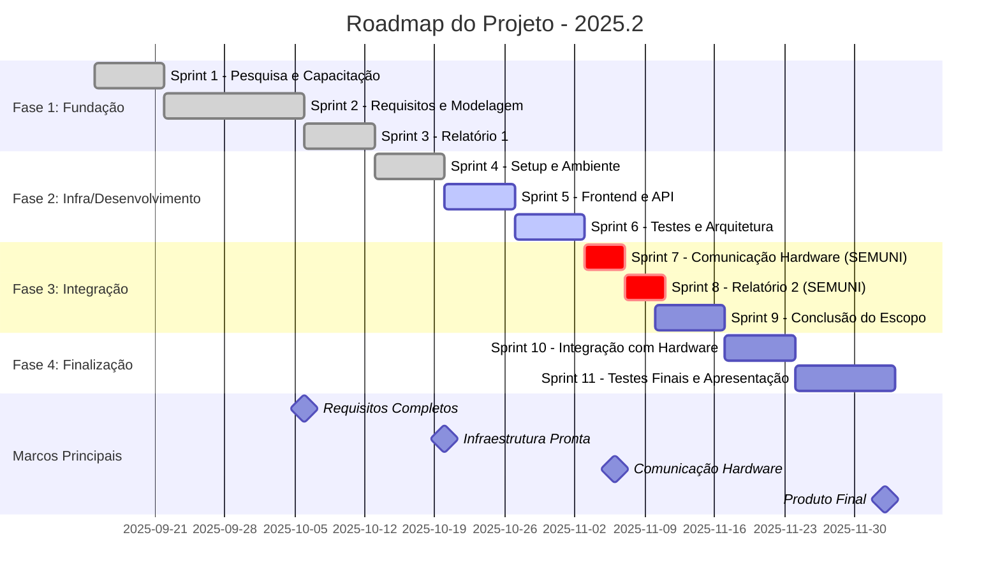

# Roadmap

## Links

- [Introdução](#introdução)
- [Objetivos](#objetivos)
- [Equipe](#equipe)
- [Sprint 1](#sprint-1-pesquisa-e-capacitação)
- [Sprint 2](#sprint-2-levantamento-priorização-e-modelagem-de-requisitos-além-de-prototipação)
- [Sprint 3](#sprint-3-escrita-do-relatório-1)
- [Sprint 4](#sprint-4-setup-de-ambiente-e-infraestrutura)
- [Sprint 5](#sprint-5-frontend-completo-e-desenvolvimento-da-api)
- [Sprint 6](#sprint-6-testes-frontend-completo-e-pesquisa-sobre-a-comunicação-com-hardware)
- [Sprint 7](#sprint-7-semuni-refinamento-das-telas-e-implementação-da-comunicação-com-harware)
- [Sprint 8](#sprint-8-semuni-escrita-do-relatório-2)
- [Sprint 9](#sprint-09-conclusão-do-escopo-de-software)
- [Sprint 10](#sprint-10-integração-com-hardware)
- [Sprint 11](#sprint-11-testes-de-integração-e-apresentação)
- [Visualização do Roadmap](#visualização-do-roadmap)

## Introdução

&emsp;&emsp;
Este documento apresenta a organização estratégica do projeto, descrevendo as principais fases, entregas e marcos planejados ao longo do seu desenvolvimento. O roadmap tem como finalidade orientar as atividades, garantir o alinhamento entre os envolvidos e permitir uma visão clara do progresso ao longo do tempo.

## Objetivos

Os principais objetivos deste roadmap são:

- Definir claramente as etapas do projeto e suas respectivas entregas;
- Facilitar o acompanhamento do cronograma e da evolução das atividades;
- Auxiliar na priorização de tarefas de acordo com o impacto e necessidade;
- Promover melhor comunicação e alinhamento entre os participantes do projeto.

## Equipe

| Nome                                                                  | Matrícula | Papel                                 |
| --------------------------------------------------------------------- | --------- | ------------------------------------- |
| [Eduardo Matheus dos Santos Sandes](https://github.com/DiceRunner714) | 221008024 | Gerente de software e desenvovedor    |
| [Guilherme Flyan Araujo](https://github.com/GFlyan)                   | 231011408 | Subgerente de software e desenvovedor |
| [André João Cordeiro Gomes](https://github.com/AJCGassassin)          | 211061402 | Desenvovedor                          |
| [Cássio Sousa dos Reis](https://github.com/csreis72)                  | 221021886 | Desenvovedor                          |
| [Márcio Henrique de Sousa Costa](https://github.com/DeM4rcio)         | 221039497 | Desenvovedor                          |
| [Yasmin Dayrell Albuquerque](https://github.com/YasminDayrell)        | 232014226 | Desenvovedora                         |

---

## Sprint 1: Pesquisa e capacitação
- **Duração:** uma semana  
- **Início:** 15/09/2025  
- **Término/Entrega:** 22/09/2025

### Objetivos
- Pesquisa sobre ferramentas:
    - Como enviar e receber dados de ESP32 via bluetooth ou WiFi?
    - Docker
    - Python3
    - fastAPI (API's REST nos atendem?)
    - PostgreSQL
    - React
    - TypeScript
- Definir formato dos dados entre o software e o hardware;
- Início do levantamento de requisitos.

### Tarefas chave
- Se capacitar nas ferramentas desconhecidas;
- Pequisar sobre a comunicação com o Hardware;
- Realizar um brainstorming para começar o levantamento de requisitos e soluções.

## Alocação da equipe

| Nome                                                   | Tarefas |
| ------------------------------------------------------ | ------- |
| [Eduardo Sandes](https://github.com/DiceRunner714)     | Todas   |
| [André Gomes](https://github.com/AJCGassassin)         | Todas   |
| [Cássio Reis](https://github.com/csreis72)             | Todas   |
| [Guilherme Araujo](https://github.com/GFlyan)          | Todas   |
| [Márcio Costa](https://github.com/DeM4rcio)            | Todas   |
| [Yasmin Albuquerque](https://github.com/YasminDayrell) | Todas   |

---

## Sprint 2: Levantamento, priorização e modelagem de requisitos além de prototipação
- **Duração:** 2 semanas
- **Início:** 22/09/2025
- **Término/Entrega:** 06/10/2025

### Objetivos
- Definir qual o escopo de software;
- Levantar os requisitos da área de software;
- Documentar os requisitos de forma clara;
- Modelar os requisitos;
- Priorizar os requisitos;
- Gerar protótipos de baixa e alta fidelidade.

### Entregáveis
- ✅ [Diagrama de casos de uso](https://github.com/PI1-2025-FCTE/2025.2-PI-Software-Docs/blob/main/diagrama-caso-uso.md)
- ✅ [Histórias de usuário](https://github.com/PI1-2025-FCTE/2025.2-PI-Software-Docs/blob/main/historias-de-usuario.md)
- ✅ [MoSCoW](https://github.com/PI1-2025-FCTE/2025.2-PI-Software-Docs/blob/main/moscow.md)
- ✅ [Diagrama entidade relacionamento (DER)](https://github.com/PI1-2025-FCTE/2025.2-PI-Software-Docs/blob/main/assets/diagrama-entidade-relacionamento.png)
- ✅ [Diagrama lógico de dados (DLD)](https://github.com/PI1-2025-FCTE/2025.2-PI-Software-Docs/blob/main/assets/diagrama-logico-de-dados.png)
- ✅ [Diagrama BPMN](https://github.com/PI1-2025-FCTE/2025.2-PI-Software-Docs/blob/main/assets/BPMN%20.png)
- ✅ [Diagrama de estados](https://github.com/PI1-2025-FCTE/2025.2-PI-Software-Docs/blob/main/diagrama-estados.md)
- ❌ Fluxo de dados
- ✅ [Requisitos não funcionais (RNF's)](https://github.com/PI1-2025-FCTE/2025.2-PI-Software-Docs/blob/main/requisitos-nao-funcionais)
- ✅ [Diagrama de alto nível (arquitetura)](https://github.com/PI1-2025-FCTE/2025.2-PI-Software-Docs/blob/main/arquitetura.md)
- ✅ Protótipo de baixa fidelidade
- ✅ [Protótipo de alta fidelidade](https://www.figma.com/design/OkpO39vj7ImHyDWaKpwxHB/Prot%C3%B3tipo-Telas-de-Controle-do-Carrinho?node-id=0-1&p=f&t=gJBnpnv5p6toqXYq-0)
- ❌ Casos de teste
- ✅ [Matriz de rastreabilidade (Backward from)](https://github.com/PI1-2025-FCTE/2025.2-PI-Software-Docs/blob/main/casos-de-teste.md)

### Tarefas chave
- Conversar com o departamento de hardware para definir o formato das instruções;
- Desenvolver os entregáveis.

## Alocação da equipe

| Nome                                                   | Tarefas                                                                                                                 |
| ------------------------------------------------------ | ----------------------------------------------------------------------------------------------------------------------- |
| [Eduardo Sandes](https://github.com/DiceRunner714)     | Casos de uso, MoSCow, Histórias de usuário, Arquitetura, DER, DLD, Fluxo de dados, Backward from, RNF's, Casos de teste |
| [André Gomes](https://github.com/AJCGassassin)         | BPMN, Diagrama de Estados, Protótipo de baixa fidelidade, Protótipo de alta fidelidade                                  |
| [Cássio Reis](https://github.com/csreis72)             | Casos de uso, MoSCow, BPMN, Arquitetura, Casos de teste, DER                                                            |
| [Guilherme Araujo](https://github.com/GFlyan)          | RNF's, Diagrama de Estados, Protótipo de alta, Histórias de usuário fidelidade                                          |
| [Márcio Costa](https://github.com/DeM4rcio)            | Casos de uso, RNF's, Arquitetura, Casos de teste                                                                        |
| [Yasmin Albuquerque](https://github.com/YasminDayrell) | Fluxo de dados, DER                                                                                                     |

---

## Sprint 3: Escrita do relatório 1
**Duração:** uma semana   
**Início:** 06/10/2025  
**Término/Entrega:** 13/10/2025

### Entregáveis
- ✅ Relatório 1
    - ✅ Descrição do software
    - ✅ Objetivo do projeto
    - ✅ Justificativa
    - ❌ Indicadores
- ✅ [Casos de teste](https://github.com/PI1-2025-FCTE/2025.2-PI-Software-Docs/blob/main/casos-de-teste.md)
- ❌ Fluxo de dados
- ✅ Protótipo interativo

## Alocação da equipe

| Nome                                                   | Tarefas                                                           |
| ------------------------------------------------------ | ----------------------------------------------------------------- |
| [Eduardo Sandes](https://github.com/DiceRunner714)     | Descrição do software, Casos de teste, revisão final do relatório |
| [André Gomes](https://github.com/AJCGassassin)         | -                                                                 |
| [Cássio Reis](https://github.com/csreis72)             | Descrição do software, Casos de teste                             |
| [Guilherme Araujo](https://github.com/GFlyan)          | Protótipo interativo                                              |
| [Márcio Costa](https://github.com/DeM4rcio)            | Objetivo do projeto, Casos de teste, Justificativa                |
| [Yasmin Albuquerque](https://github.com/YasminDayrell) | Fluxo de dados, Indicadores                                       |

---

## Sprint 4: Setup de ambiente e Infraestrutura
**Duração:** uma semana 
**Início:** 13/10/2025  
**Término/Entrega:** 20/10/2025

### Objetivos
- Criar os repositórios para o frontend e o backend
- Subir o docker em cada repositório
- Criar uma esteira de qualidade CI em ambos os repositórios

### Entregáveis
- ✅ Guias de contribuição
- ✅ Template issue
- ✅ Template PR
- ✅ [Repositório - 2025.2-PI-Front](https://github.com/PI1-2025-FCTE/2025.2-PI-Front)
    - ✅ Repositório criado
    - ✅ Estrutura do docker
    - ✅ Estrutura básica do Next.js 
    - ✅ CI
- ✅ [Repositório - 2025.2-PI-Service](https://github.com/PI1-2025-FCTE/2025.2-PI-Service)
    - ✅ Repositório criado
    - ✅ Estrutura do docker
    - ✅ Estrutura básica do FastAPI
    - ✅ Tabelas da base de dados criadas
    - ✅ Conexão com banco de dados
    - ✅ CI 
- ✅ [Fluxo de dados](https://github.com/PI1-2025-FCTE/2025.2-PI-Software-Docs/blob/main/assets/fluxo-de-dados.jpg)

## Alocação da equipe

| Nome                                                   | Tarefas                                                                                                                                  |
| ------------------------------------------------------ | ---------------------------------------------------------------------------------------------------------------------------------------- |
| [Eduardo Sandes](https://github.com/DiceRunner714)     | Estrutura do docker (frontend), Estrutura básica do FastAPI, Tabelas da base de dados criadas, Conexão com banco de dados, CI (frontend) |
| [André Gomes](https://github.com/AJCGassassin)         | -                                                                                                                                        |
| [Cássio Reis](https://github.com/csreis72)             | Estrutura do docker (backend), Estrutura básica do FastAPI, Tabelas da base de dados criadas, Conexão com banco de dados, CI (backend)   |
| [Guilherme Araujo](https://github.com/GFlyan)          | -                                                                                                                                        |
| [Márcio Costa](https://github.com/DeM4rcio)            | Guias de contribuição, Template issue, Template PR, Repositórios criados, Estrutura básica do Next.js                                    |
| [Yasmin Albuquerque](https://github.com/YasminDayrell) | Fluxo de dados                                                                                                                           |

---

## Sprint 5: Frontend completo e desenvolvimento da API
**Duração:** uma semana   
**Início:** 20/10/2025  
**Término/Entrega:** 27/10/2025

### Objetivos
- Terminar as telas de acordo com o protótipo
- Criar os endpoints básicos da api
- Entender como implementar a comunicação com o hardware

### Entregáveis
- 🟢 Telas do frontend
    - 🟢 Componentes do frontend 
    - 🟢 Instrução
    - 🟢 Listagem
    - 🟢 Detalhe
- ✅ Endpoints da API
- 🟢 Arquitetura validada (comunicação com a ESP32) 

## Alocação da equipe

| Nome                                                   | Tarefas                                                      |
| ------------------------------------------------------ | ------------------------------------------------------------ |
| [Eduardo Sandes](https://github.com/DiceRunner714)     | Endpoints da API                                             |
| [André Gomes](https://github.com/AJCGassassin)         | Telas: Instrução, Listagem, Detalhe                          |
| [Cássio Reis](https://github.com/csreis72)             | Endpoints da API                                             |
| [Guilherme Araujo](https://github.com/GFlyan)          | Telas: Instrução, Listagem, Detalhe, Componentes do frontend |
| [Márcio Costa](https://github.com/DeM4rcio)            | Arquitetura validada (comunicação com a ESP32)               |
| [Yasmin Albuquerque](https://github.com/YasminDayrell) | Telas: Instrução, Testes                                     |

---

## Sprint 6: Testes, frontend completo e pesquisa sobre a comunicação com hardware
**Duração:** uma semana  
**Início:** 27/10/2025  
**Término/Entrega:** 03/11/2025

### Objetivos
- Finalizar mudanças arquiteturais
- Testar o código produzido

### Entregáveis
- ✅ Testes da API
- ⚪ Testes do frontend (e2e)
- ✅ Telas do frontend
    - ✅ Componentes do frontend
    - ✅ Instrução
    - ✅ Listagem
    - ✅ Detalhe
- ✅ Arquitetura refinada

## Alocação da equipe

| Nome                                                   | Tarefas                                                      |
| ------------------------------------------------------ | ------------------------------------------------------------ |
| [Eduardo Sandes](https://github.com/DiceRunner714)     | Testes da API                                                |
| [André Gomes](https://github.com/AJCGassassin)         | Telas: Instrução, Listagem, Detalhe                          |
| [Cássio Reis](https://github.com/csreis72)             | Testes da API                                                |
| [Guilherme Araujo](https://github.com/GFlyan)          | Telas: Instrução, Listagem, Detalhe, Componentes do frontend |
| [Márcio Costa](https://github.com/DeM4rcio)            | Arquitetura refinada                                         |
| [Yasmin Albuquerque](https://github.com/YasminDayrell) | Testes do frontend                                           |

---

## Sprint 7 (SEMUNI): Refinamento das telas e implementação da comunicação com harware
**Duração:** 4 dias  
**Início:** 03/11/2025  
**Término/Entrega:** 06/11/2025

### Objetivos
- Finalizar o frontend
- Implementar as mudanças na arquitetura
- Implementar as features de comunicação com a ESP32

### Entregáveis
- ✅ Frontend integrado com a API
- 🟡 Testes do frontend (e2e)
- ✅ Fila MQTT implementada (mudança na arquitetura)
    - ✅ Broker MQTT
    - ✅ ESP mock
    - ✅ Testes
    - ✅ Passar o id do trajeto para ESP32
- ✅ Funcionalidade implementada: mapa das trajetórias

## Alocação da equipe

| Nome                                                   | Tarefas                              |
| ------------------------------------------------------ | ------------------------------------ |
| [Eduardo Sandes](https://github.com/DiceRunner714)     | ESP mock, Passar o id para ESP32     |
| [André Gomes](https://github.com/AJCGassassin)         | Mapa das trajetórias                 |
| [Cássio Reis](https://github.com/csreis72)             | Broker MQTT, ESP mock, Testes (MQTT) |
| [Guilherme Araujo](https://github.com/GFlyan)          | Frontend integrado com a API         |
| [Márcio Costa](https://github.com/DeM4rcio)            | Broker MQTT                          |
| [Yasmin Albuquerque](https://github.com/YasminDayrell) | Testes do frontend                   |

---

## Sprint 8 (SEMUNI): Escrita do relatório 2
**Duração:** 4 dias  
**Início:** 07/11/2025  
**Término/Entrega:** 10/11/2025

### Objetivos
- Finalizar mudanças arquiteturais
- Testar o código produzido

### Entregáveis
- 🟡 Testes do frontend (e2e)
- ✅ Relatório 2
    - ✅ Correções R1
        - ✅ Listar histórias de usuário
        - ✅ Revisar requisitos
        - ✅ Atualizar protótipo
        - ✅ Atualizar arquitetura
    - ✅ Testes de software
        - ✅ Associar US's com protótipo
        - ✅ Testes do frontend
        - ✅ Testes do backend

## Alocação da equipe

| Nome                                                   | Tarefas                                                                          |
| ------------------------------------------------------ | -------------------------------------------------------------------------------- |
| [Eduardo Sandes](https://github.com/DiceRunner714)     | Listar histórias de usuário, Testes do backend, Revisar requisitos               |
| [André Gomes](https://github.com/AJCGassassin)         | Associar US's com protótipo                                                      |
| [Cássio Reis](https://github.com/csreis72)             | Testes do backend                                                                |
| [Guilherme Araujo](https://github.com/GFlyan)          | Associar US's com protótipo, Testes do frontend (relatório), Atualizar protótipo |
| [Márcio Costa](https://github.com/DeM4rcio)            | Atualizar arquitetura                                                            |
| [Yasmin Albuquerque](https://github.com/YasminDayrell) | Testes do frontend, Testes do frontend (relatório)                               |

---

## Sprint 09: Conclusão do escopo de software
**Duração:** uma semana  
**Início:** 10/11/2025  
**Término/Entrega:** 17/11/2025

### Objetivos
- Concluir o escopo do software

### Entregáveis
- 🟡 Software completo
    - 🟡 Testes do frontend (e2e)
    - ✅ Funcionalidade: Validar comandos antes do envio
    - 🟡 Funcionalidade: Baixar relatório
    - ❌ Funcionalidade: Parar carrinho
    - 🟢 Interface de envio de comandos amigável ao usuário
    - ✅ Versão mais recente integrada na main

## Alocação da equipe

| Nome                                                   | Tarefas                                                                         |
| ------------------------------------------------------ | ------------------------------------------------------------------------------- |
| [Eduardo Sandes](https://github.com/DiceRunner714)     | Validar comandos antes do envio, Versão mais recente na main                    |
| [André Gomes](https://github.com/AJCGassassin)         | Mapa das trajetórias                                                            |
| [Cássio Reis](https://github.com/csreis72)             | Versão mais recente na main, Interface de envio de comandos amigável ao usuário |
| [Guilherme Araujo](https://github.com/GFlyan)          | Baixar relatório                                                                |
| [Márcio Costa](https://github.com/DeM4rcio)            | Arquitetura refinada                                                            |
| [Yasmin Albuquerque](https://github.com/YasminDayrell) | Testes do frontend                                                              |

---

## Sprint 10: Integração com hardware
**Duração:** uma semana  
**Início:** 17/11/2025  
**Término/Entrega:** 24/11/2025

### Objetivos
- Garantir que a comunicação com o hardware está funcionando

### Entregáveis
- ✅ Testes da comunicação com hardware
- ✅ Revisão dos artefatos de documentação
- ✅ Interface de envio de comandos amigável ao usuário
- 🟡 Software completo
    - 🟢 Testes do frontend (e2e)
    - ✅ Funcionalidade: Baixar relatório
    - ❌ Funcionalidade: Parar carrinho
    - ✅ Interface de envio de comandos amigável ao usuário
    - 🟢 Funcionalidade implementada: comparação entre percurso desejado e executado

## Alocação da equipe

| Nome                                                   | Tarefas                                            |
| ------------------------------------------------------ | -------------------------------------------------- |
| [Eduardo Sandes](https://github.com/DiceRunner714)     | Revisão dos artefatos de documentação              |
| [André Gomes](https://github.com/AJCGassassin)         | Comparação entre percurso desejado e executado     |
| [Cássio Reis](https://github.com/csreis72)             | Interface de envio de comandos amigável ao usuário |
| [Guilherme Araujo](https://github.com/GFlyan)          | Baixar relatório                                   |
| [Márcio Costa](https://github.com/DeM4rcio)            | Testes da comunicação com hardware                 |
| [Yasmin Albuquerque](https://github.com/YasminDayrell) | Testes do frontend                                 |

---

## Sprint 11: Testes de integração e apresentação
**Duração:** 10 dias  
**Início:** 24/10/2025  
**Término/Entrega:** 03/11/2025

### Objetivos
- Testar o produto completo e integrado
- Preparar a apresentação

### Entregáveis
- 🟢 Software completo
    - ✅ Testes do frontend (e2e)
    - ✅ Testes do frontend (componente)
    - 🟡 Funcionalidade: Parar carrinho
    - ✅ Funcionalidade implementada: comparação entre percurso desejado e executado
    - ✅ Mostrar o tempo e a distância percorrida na tela de detalhe de percurso
- ❌ Extra: otimização de strings de instrução
- 🟢 Slide da apresentação
- ⚪ Video da apresentação
- ⚪ Correções do relatório
- ✅ Pesquisa: requisitos computacionais mínimos para rodar a aplicação

### Tarefas chave
- Testes de integração

## Alocação da equipe

| Nome                                                   | Tarefas                                                                                     |
| ------------------------------------------------------ | ------------------------------------------------------------------------------------------- |
| [Eduardo Sandes](https://github.com/DiceRunner714)     | Testes de integração, Video, Correções do relatório                                         |
| [André Gomes](https://github.com/AJCGassassin)         | Slides, comparação entre percurso desejado e executado, Parar carrinho                      |
| [Cássio Reis](https://github.com/csreis72)             | Testes do frontend (componente), tempo e a distância na tela de detalhe de percurso, Slides |
| [Guilherme Araujo](https://github.com/GFlyan)          | Slides, Parar carrinho, Pesquisa                                                            |
| [Márcio Costa](https://github.com/DeM4rcio)            | Testes de integração, Slides, Parar carrinho                                                |
| [Yasmin Albuquerque](https://github.com/YasminDayrell) | Slides, Testes do frontend (e2e)                                                            |

---

## Visualização do Roadmap

---

## Milestones

| Milestone                                      | Descrição                                                 | Critério de Conclusão                        | Sprint/Entrega                    | Status           |
| ---------------------------------------------- | --------------------------------------------------------- | -------------------------------------------- | --------------------------------- | ---------------- |
| ** Planejamento e Requisitos Concluídos**      | Todo o escopo inicial documentado e protótipos definidos  | Todos os artefatos de requisitos completos   | **Fim da Sprint 2 (06/10/2025)**  | ✅ Concluído     |
| ** Infraestrutura e Setup Concluídos**         | Ambientes prontos para desenvolvimento com CI/CD aplicado | Docker, repositórios e esteira funcionando   | **Fim da Sprint 4 (20/10/2025)**  | ✅ Concluído     |
| ** Funcionalidades de Frontend e API Básicas** | Telas funcionais e endpoints REST integrados              | UI + API operando sem comunicação com ESP    | **Fim da Sprint 5 (27/10/2025)**  | ✅ Concluído     |
| ** Comunicação com Hardware Viável**           | Arquitetura final aprovada e conexão com ESP32 funcional  | MQTT funcionando + testes realizados         | **Fim da Sprint 7 (06/11/2025)**  | ✅ Concluído     |
| ** Testes e Estabilização do Software**        | Produto testado com requisitos atendidos                  | Software + testes do frontend e backend      | **Fim da Sprint 9 (17/11/2025)**  | ✅ Concluído  |
| ** Entrega Final do Produto**                  | Produto integrado, funcional e documentado                | Software completo + relatório + apresentação | **Fim da Sprint 11 (03/12/2025)** | 🟢 Progredindo como planejado  |

---

## Legenda
- ✅ **Completado**
- 🟢 **Progredindo como planejado** 
- 🟡 **Em progresso**
- 🟠 **Atenção**
- 🔴 **Requer intervenção**
- ❌ **Não entregue**
- ⚪ **Não iniciado**

---

## Notas
- Toda sprint inclui uma planning, review e retrospect (feitas durante a aula)
- São realizadas Daily's segundas, quartas e sextas

---